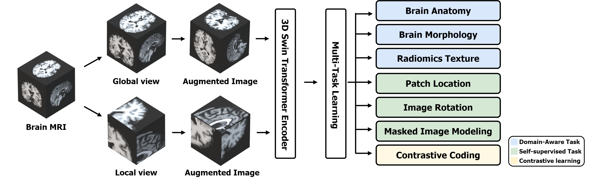
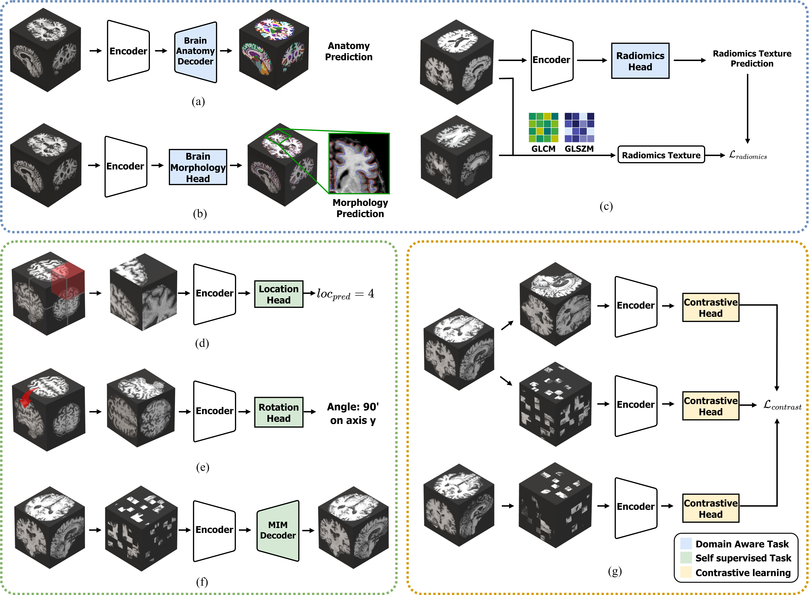

# Paper

Domain Aware Multi-Task Pretraining of 3D Swin Transformer for Brain MRI [Jonghun Kim ^1,2^], [Mansu Kim^3^], [Hyunjin Park^1,2^]
^1^Department of Electrical and Computer Engineering, Sungkyunkwan University
^2^Center for Neuroscience Imaging Research, Institute for Basic Science
^3^Gwanju Institute of Science and Technology

# Overview

This repository contains the code for DAMT: Domain Aware Multi-Task Pretraining of 3D Swin Transformer for Brain MRI. The DAMT consists of the following seven pretrain tasks.

The seven task is detailed in the figure below:

